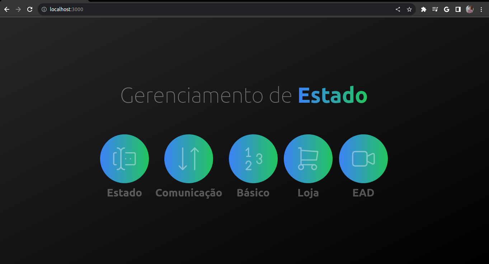

# Menu da Aplicação

<p align="center">
</img>
</img>
</p>

# Curso Gerenciamento de Estado

Curso fala sobre gerenciamento de estado com React e Context API.

## O que você vai encontrar neste repositório

- **Primeiro**: Montamos a estrutura do projeto.
- **Revisão**: Nos itens "Estado" e "Comuicação" foi usado para realizar uma revisão de assuntos fundamentais de React.
- **Exemplo com Context API**: No item "Básico" da aplicação foi feito um exemplo super simples, mas esclarecedor sobre o uso de Context API para gerenciamento de estado com React.
- **Loja**: A ideia foi construir um catálogo de produtos e um componente de carrinho para simular uma loja online.
- **EAD**: Aqui foi construido uma mini EAD exibindo os capítulos e aulas mostrando as estatísticas do curso. 

# 🤔 Segue abaixo como o projeto foi criado caso queira baixar e rodar no seu PC 
This is a [Next.js](https://nextjs.org/) project bootstrapped with [`create-next-app`](https://github.com/vercel/next.js/tree/canary/packages/create-next-app).

## Getting Started

First, run the development server:

```bash
npm run dev
# or
yarn dev
# or
pnpm dev
```

Open [http://localhost:3000](http://localhost:3000) with your browser to see the result.

You can start editing the page by modifying `pages/index.tsx`. The page auto-updates as you edit the file.

[API routes](https://nextjs.org/docs/api-routes/introduction) can be accessed on [http://localhost:3000/api/hello](http://localhost:3000/api/hello). This endpoint can be edited in `pages/api/hello.ts`.

The `pages/api` directory is mapped to `/api/*`. Files in this directory are treated as [API routes](https://nextjs.org/docs/api-routes/introduction) instead of React pages.

This project uses [`next/font`](https://nextjs.org/docs/basic-features/font-optimization) to automatically optimize and load Inter, a custom Google Font.

## Learn More

To learn more about Next.js, take a look at the following resources:

- [Next.js Documentation](https://nextjs.org/docs) - learn about Next.js features and API.
- [Learn Next.js](https://nextjs.org/learn) - an interactive Next.js tutorial.

You can check out [the Next.js GitHub repository](https://github.com/vercel/next.js/) - your feedback and contributions are welcome!

## Deploy on Vercel

The easiest way to deploy your Next.js app is to use the [Vercel Platform](https://vercel.com/new?utm_medium=default-template&filter=next.js&utm_source=create-next-app&utm_campaign=create-next-app-readme) from the creators of Next.js.

Check out our [Next.js deployment documentation](https://nextjs.org/docs/deployment) for more details.
